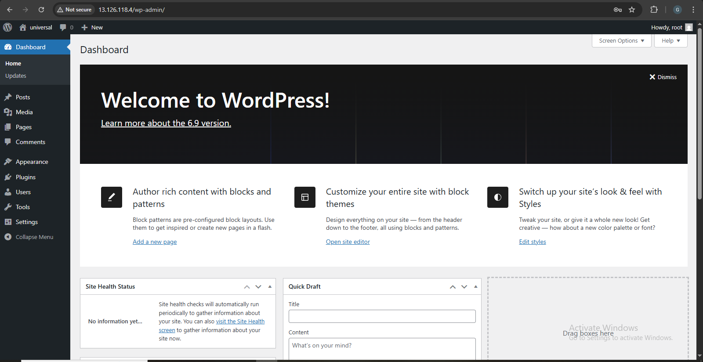
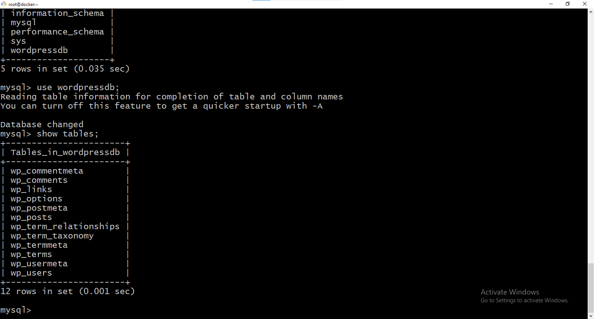
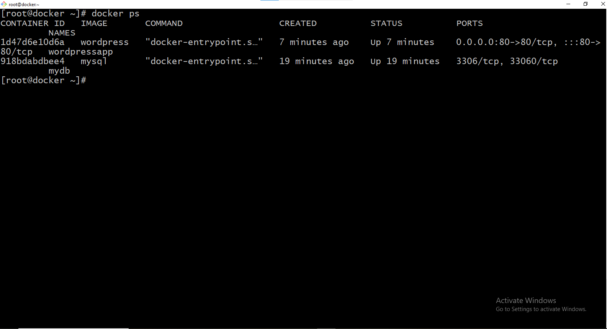

# Dockerized WordPress – 2-Tier Architecture

##  Project Overview

This project demonstrates a **2-Tier architecture** using **Docker**, where:

- **Tier 1 (Application Layer):** WordPress container  
- **Tier 2 (Database Layer):** MySQL container  

Both containers run independently but communicate over a Docker network.  
This setup reflects a real-world **DevOps containerized deployment approach**.

---

##  Architecture Flow

User Browser  
↓  
WordPress Container (Apache + PHP)  
↓  
MySQL Container (Database)


 

### Flow Explanation

1. User accesses the application using a browser (via server IP or domain).
2. The request reaches the **WordPress container** exposed on port **80**.
3. WordPress processes the request and connects to MySQL using Docker internal networking.
4. The **MySQL container** stores and retrieves application data.
5. The response is returned to the user through WordPress.

---

##  Architecture Type

- 2-Tier Architecture  
- Containerized using Docker  
- Application and Database isolation  

---

##  Tech Stack Used

- Docker  
- WordPress (Apache + PHP)  
- MySQL  
- Docker Networking  
- Linux OS  

---

##  Project Structure
```
project-root/
│── IMG
│── README.md
```


---

##  Docker Components

### 1️⃣ WordPress Container

- Runs Apache + PHP
- Exposed on port **80**
- Connects to MySQL using container name

### 2️⃣ MySQL Container

- Runs MySQL database
- Database created using environment variables
- Accessible only inside Docker network

---

##  How to Run the Project

This project is executed **without docker-compose**, using `docker run` commands.

### Step 1: Pull Images from Docker Hub

```bash
docker pull mysql
docker pull wordpress
```
### Docker Hub Images Used:

https://hub.docker.com/_/mysql

https://hub.docker.com/_/wordpress


### Step 2: Create MySQL Container (Database Tier)
```
docker run -d \
 --name mydb \
 -e MYSQL_ROOT_PASSWORD=root \
 -e MYSQL_DATABASE=wordpressdb \
 mysql
```
### Step 3: Create WordPress Container (Application Tier)
```
docker run -d \
 -p 80:80 \
 --name wordpressapp \
 -e WORDPRESS_DB_HOST=mydb \
 -e WORDPRESS_DB_USER=root \
 -e WORDPRESS_DB_PASSWORD=root \
 -e WORDPRESS_DB_NAME=wordpressdb \
 --link mydb:mysql \
 wordpress
```
### Step 4: Access the Application

**Open your browser and visit:**
```
http://<server-ip>
```
Complete the WordPress installation using the UI.


###  Project Screenshots

| Screenshot | Description |
|-----------|-------------|
|  | WordPress application running inside Docker container after successful setup |
|  | MySQL database tables created automatically by WordPress inside MySQL container |
|  | Running Docker containers showing WordPress and MySQL containers |


###  Networking & Security

- Docker bridge network used for communication

- MySQL port is not exposed publicly

- Secure communication via environment variables

###  What You Learn From This Project

- Docker container fundamentals

- 2-Tier application architecture

- WordPress and MySQL container integration

- Docker networking concepts

- Environment variable configuration

- Real-world DevOps deployment workflow

###  Use Cases

- Learning Docker & container networking

- DevOps portfolio project

- Local WordPress development setup

- Interview demonstration project

### Author

**Ganesh Jadhav** 

Cloud & DevOps Enthusiast

BCA Graduate

Hands-on experience with Docker, Linux, AWS, Ansible, Terraform

**Gmail** : khandagalehrishikesh7@gmail.com

**linkedin:** https://www.linkedin.com/in/hrishikesh-khandagale-0b5b27387/

Conclusion

This project demonstrates how a traditional WordPress application can be deployed using a Docker-based 2-Tier architecture, providing application isolation, scalability, and simplified deployment using modern DevOps practices.